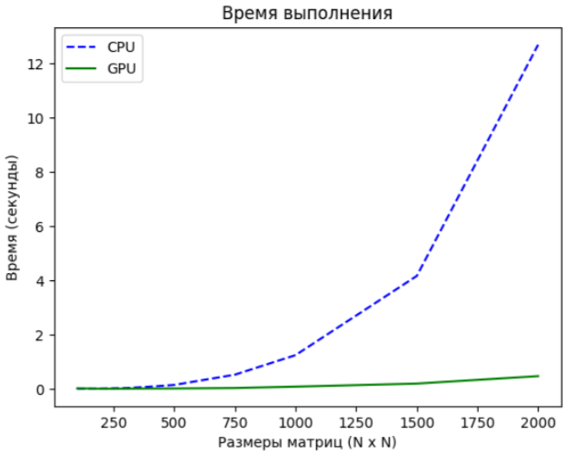
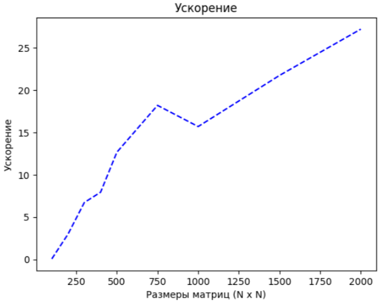

# ЛР 0: Matmul
## Сделал Бирюков Влад 6132-010402D

## Задание

Задача: реализовать алгоритм перемножения матриц

Язык: C++ или Python
Входные данные: 2 матрицы размером от 100х100 до 2000х2000 каждая.

Выходные данные: проверка корректности перемножения + время вычисления

Реализация должна содержать 2 функции перемножения матриц: на CPU и на GPU с применением CUDA.

Отчет о проделанной лабораторной работе - это git-репозиторий с исходным кодом реализации + описание проделанной работы там же в readme.

Необходимо описать реализацию, объяснив, что конкретно было распараллелено и почему. Провести эксперименты: перемножить матрицы разных размеров, посчитать ускорение. Результаты привести в виде таблицы/графика.

## Ход работы

Работа реализована в Google Collab, дабы использовать их вычислительные мощности, а не мощности своего старого умирающего ноута. [Ссылка на ЛР в коллабе](https://colab.research.google.com/drive/12lnWdr7cnPfx3ZhWWNZdYiT8hM_dDJO3?usp=sharing)

1. Генерация матрицы с случайными целочисленными значениями от 0 до 3, заданной размерности с помощью функции generateRandomMatrix.

2. Умножение матриц на центральном процессоре, используя оператор @, так как написанная функция умножения cpuMatrixMultiply работает слишком медленно.

3. Замер времени выполнения умножения на CPU.

4. Умножение матриц на графическом процессоре с помощью функции gpuMatrixMultiply.

5. Замер времени выполнения умножения на GPU.

6. Сравнение результатов умножения для проверки их корректности (сравниваем две матрицы, полученные разными методами).

7. Усреднение результатов времени выполнения для каждой размерности матриц.

8. Построение графиков зависимости времени выполнения от размерности матрицы для CPU и GPU.

9. Построение графиков зависимости ускорения программы от размерности матрицы.

### Параллелизация

Распараллеливанию подвергались умножение и сложение, выполняемые для вычисления элементов результирующей матрицы. Для этого данные из двух входных матриц передавались на устройство (GPU), чтобы все созданные потоки могли выполнить ядро над этими данными. После вычислений результаты возвращались обратно на хост (CPU). Каждый поток вычислял отдельный элемент результирующей матрицы.

### Результаты
График времени

График ускорения

