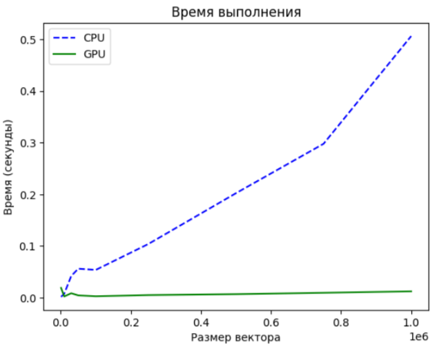
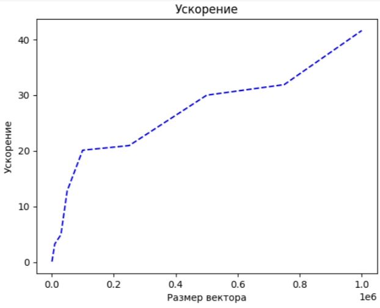

# ЛР 1: VectorSum
## Сделал Бирюков Влад 6132-010402D

## Задание

Задача: реализовать алгоритм сложения элементов вектора

Язык: C++ или Python

Входные данные: Вектор размером 1 000..1 000 000 значений.

Выходные данные: сумма элементов вектора + время вычисления

Реализация должна содержать 2 функции сложения элементов вектора: на CPU и на GPU с применением CUDA.

Отчет о проделанной лабораторной работе - это git-репозиторий с исходным кодом реализации + описание проделанной работы там же в readme.

Необходимо описать реализацию, объяснив, что конкретно было распараллелено и почему.

Провести эксперименты: получить сумму векторов разных размеров (провести 5 или более экспериментов), посчитать ускорение. Результаты привести в виде таблицы/графика.

## Ход работы

Работа реализована в Google Collab, дабы использовать их вычислительные мощности, а не мощности своего старого умирающего ноута. [Ссылка на ЛР в коллабе](https://colab.research.google.com/drive/19_6uO_0M2DGZg10imbele6m2HJS9v1jp?usp=sharing)

1. Генерация векторов с случайными целыми значениями (от 0 до 10) заданной размерности с помощью функции generateRandomVector.

2. Сложение векторов на центральном процессоре (CPU) с помощью функции cpuVectorSum.

3. Замер времени выполнения на CPU.

4. Сложение векторов на графическом процессоре (GPU) с помощью функции gpuVectorSum.

5. Замер времени выполнения на GPU.

6. Сравнение результатов сложения, проверка равенства двух векторов, полученных разными методами.

7. Усреднение результатов времени выполнения для каждой размерности векторов.

8. Построение графиков зависимости времени выполнения от размерности векторов для CPU и GPU.

9. Построение графиков зависимости ускорения выполнения программы от размерности векторов.

### Параллелизация

Было распараллелено сложение для вычисления элементов результирующего вектора. Для этого данные из двух входных векторов передавались на устройство (GPU), чтобы все созданные потоки могли выполнить функцию ядра над этими данными. После выполнения вычислений результаты возвращались обратно на хост (CPU). Каждый поток (ядро CUDA) вычислял отдельный элемент результирующего вектора.

### Результаты
График времени

График ускорения

